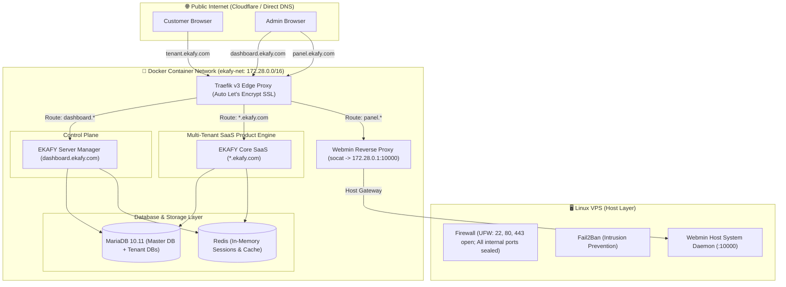

# EKAFY Cloud Server Platform - v2

Welcome to **EKAFY v2**, a modern, cloud-native, multi-tenant SaaS platform and server management suite built on Docker, Node.js, and Traefik v3.

---

## 🚀 Architecture Overview



---

## 🔑 Core Components & Domains

| Service | Public Domain | Description | Authentication |
| :--- | :--- | :--- | :--- |
| **Server Manager** | `https://dashboard.ekafy.com` | Full Control Panel: Telemetry, Services, Logs, Tenant Provisioning, Projects CRM, SQL Console, Backups | **Google OAuth SSO** |
| **Core SaaS Engine** | `https://*.ekafy.com` | Multi-Tenant Business SaaS applications (Employees, Attendance, Quotations) with dynamic DB routing | Tenant Auth / API |
| **Webmin System Panel** | `https://panel.ekafy.com` | Host Linux OS administration console securely proxied via Traefik | Host Linux User PAM |
| **Traefik Edge Proxy** | Ports `80` & `443` | Reverse proxy with automatic Let's Encrypt SSL (HTTP-01 ACME Challenge) | Transparent TLS |
| **MariaDB Cluster** | Internal Port `3306` | Isolated database-per-tenant architecture (`ekafy_master` + `db_tenant_*`) | Root / Admin Pool |
| **Redis Engine** | Internal Port `6379` | High-speed cache and session management | Password Protected |

---

## 📊 Server Manager Dashboard Features

The Server Manager at `https://dashboard.ekafy.com` includes:

1. **📊 Overview & Telemetry**:
   - Real-time animated meters for **CPU Load**, **RAM Usage**, **Disk Space**, and **Continuous Uptime**.
   - Server details (Host, Server IP, Node.js version, OS, Panel host, Load averages).
   - Platform summaries (Active Tenants, Agency Projects, Registered Users, Core domain).

2. **⚙️ Services & Infrastructure**:
   - Status indicators for all cluster services (`traefik`, `mariadb`, `redis`, `core`, `manager`, `webmin`, `fail2ban`, `ufw`) with port mappings and health monitoring.

3. **📜 System Logs Streamer**:
   - Interactive log inspector with service filter selector (`traefik`, `mariadb`, `core`, `manager`, `redis`), refresh, and auto-scroll.

4. **🏢 SaaS Tenants Management**:
   - Organization directory with database mapping and plan tiers.
   - **"+ Provision Tenant" modal**: instantly creates isolated customer databases (`db_tenant_*`), injects blueprint tables, and configures subdomains.
   - One-click Suspend / Activate controls and direct tenant app links.

5. **📁 Client Projects (Agency CRM)**:
   - Full tracking for agency client deliveries and custom projects.

6. **🗄️ Database Management & Live SQL Console**:
   - Database browser showing table counts and storage.
   - **Interactive SQL Query Console**: Select any master or tenant database and run real-time queries with formatted output tables.

7. **💾 Backups & Disaster Recovery**:
   - Snapshot archive browser (`/app/backups`) and cloud remote storage status (rclone / Google Drive).

8. **👥 Users & Access Control**:
   - Administrator directory, roles, and Google SSO access rules.

---

## 🔒 Google OAuth Setup (Single Sign-On)

1. Open **[Google Cloud Console](https://console.cloud.google.com/)** $\rightarrow$ **APIs & Services** $\rightarrow$ **Credentials**.
2. Click **+ CREATE CREDENTIALS** $\rightarrow$ **OAuth client ID** (Web application).
3. Under **Authorized JavaScript origins**, add:
   ```text
   https://dashboard.ekafy.com
   ```
4. Under **Authorized redirect URIs**, add:
   ```text
   https://dashboard.ekafy.com/api/auth/google/callback
   ```
5. Add your credentials to `.env`:
   ```ini
   GOOGLE_OAUTH_CLIENT_ID=your-client-id.apps.googleusercontent.com
   GOOGLE_OAUTH_CLIENT_SECRET=your-client-secret
   ```
   *(The first Google user to sign in is automatically provisioned as the Primary System Administrator).*

---

## 🌍 Production Deployment on VPS

Deploying on a raw Ubuntu 20.04/22.04/24.04 VPS is completely automated:

```bash
# 1. Clone the repository
git clone https://github.com/rangavimukthiem/serverpanel.git ~/serverpanel
cd ~/serverpanel

# 2. Run the automated setup script as root
chmod +x setup-vps.sh
sudo ./setup-vps.sh
```

### What `setup-vps.sh` automatically performs:
- Hardens SSH and disables password authentication for root (if keys are detected).
- Configures UFW firewall (Ports 22, 80, 443 open; internal Docker subnet `172.28.0.0/16` allowed; database ports sealed).
- Installs and enables Fail2Ban.
- Installs Webmin with auto-SSL offloading and domain referer whitelisting for `panel.ekafy.com`.
- Installs Docker Engine and Docker Compose.
- Generates cryptographically secure random passwords for databases and JWT.
- Automatically boots the Traefik, MariaDB, Redis, Manager, and Core cluster!

---

## 🛠️ Maintenance & CLI Commands

```bash
cd ~/serverpanel

# Rebuild and restart specific services
sudo docker compose up -d --build manager
sudo docker compose up -d --build core

# View live container logs
sudo docker compose logs -f manager
sudo docker compose logs -f core
sudo docker compose logs -f traefik

# Restart entire cluster
sudo docker compose restart

# Full clean rebuild
sudo docker compose down
sudo docker compose up -d --build
```

---

## 📂 Codebase Structure

```text
serverpanel/
├── .env.example                     # Environment template with secrets & domains
├── docker-compose.yml               # Cluster orchestration with static IPAM subnet
├── setup-vps.sh                     # Automated VPS setup, hardening & provisioning
│
├── manager/                         # Server Manager (dashboard.ekafy.com)
│   ├── Dockerfile
│   ├── public/                      # Glassmorphic SPA Frontend
│   │   ├── index.html               # Main Control Panel Dashboard
│   │   ├── login.html               # Google SSO Sign In interface
│   │   ├── css/style.css            # Dark theme & design system tokens
│   │   └── js/app.js                # State management, telemetry & API client
│   └── src/
│       ├── controllers/             # System, Tenant, Auth, Project controllers
│       ├── routes/                  # Express API routers
│       └── server.js                # Database retry init & static SPA server
│
├── core/                            # Multi-Tenant SaaS Engine (*.ekafy.com)
│   ├── Dockerfile
│   └── src/
│       ├── config/db.js             # Dynamic tenant DB pool cache & credentials
│       ├── middleware/              # Subdomain dynamic tenant resolver
│       ├── routes/                  # Modular business logic (Employees, Quotations)
│       └── server.js                # Core tenant application server
│
└── _archive_legacy_v1/              # Deprecated legacy code archive
```
